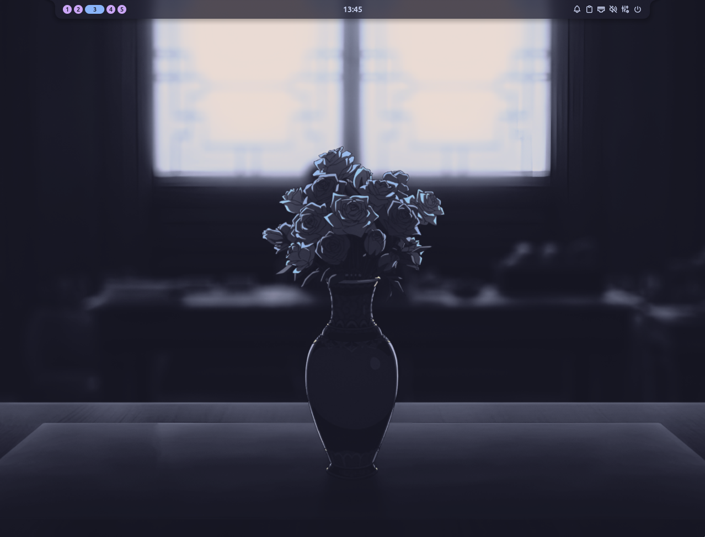

#+TITLE: Dotfiles
#+AUTHOR: Christopher James Hayward
#+EMAIL: ch.hayward7@gmail.com

#+STARTUP: overview
#+STARTUP: hideblocks

#+EXPORT_FILE_NAME: README

#+HTML: 
#+HTML: 
#+HTML: 

Built for Life, Liberty, and the Open Road.

- [100%] Immutable
- [100%] Declarative
- [100%] Reproducible

* Introduction

This is my personal configuration for GNU/Linux systems. It enables a consistent experience and computing environment across all of my machines.

#+BEGIN_QUOTE
💡 =TIP=
NixOS is a unique, declarative Linux distribution designed for high reliability, reproducibility, and atomic upgrades. It uses a single (or tree) of configuration files (`configuration.nix`) to manage the entire system state, packages, services, and settings rather than imperative step-by-step modifications.
#+END_QUOTE

This repository contains two hosts:

- One built using a Windows 11 Host running on a QEMU VM
- One running on bare metal on a Linux Machine

* Making Changes

After creating, removing, or enabling any modules refer to the following commands to activate system changes and build new derivations:

|-------+-------------------------------+--------------------------------------|
| Alias | Command                       | Description                          |
|-------+-------------------------------+--------------------------------------|
| `cdd` | `cd /etc/nixos/`              | Change directory to `$DOTFILES`      |
| `nfc` | `nix flake check`             | Check the flake for any errors       |
| `nfu` | `nix flake update`            | Update the flake inputs              |
| `ngc` | `nix-collect-garbage -d`      | Delete all previous derivations      |
| `nrs` | `sudo nixos-rebuild switch`   | Build and switch to a new derivation |
| `nrr` | `sudo nixos-rebuild rollback` | Rollback to the last derivation      |
|-------+-------------------------------+--------------------------------------|

For modules that are defined for Home Manager, they must be imported in your specific user module.

#+BEGIN_QUOTE
💡 =TIP=
See [[file:./modules/users/anon.nix][anon.nix]] and [[file:modules/features/git.nix][git.nix]] as examples.
#+END_QUOTE

Some modules require configuration in both NixOS and Home Manager. The NixOS module must be imported in your host module, and the Home Manager module must be imported in your user module.

#+BEGIN_QUOTE
💡 =TIP=
See [[file:modules/features/hyprland.nix][hyprland.nix]] and [[file:modules/features/stylix.nix][stylix.nix]] as examples.
#+END_QUOTE

* Getting Started

Follow these instructions if you want to deploy this configuration onto a QEMU virtual machine. The instructions are for running on a Windows 11 Host but should also work for GNU/Linux based hosts.

* Host System Setup

1. [[https://qemu.org/download/][Download the latest version of QEMU (11)]]
   
2. [[https://nixos.org/download][Download the latest version of the minimal NixOS ISO]]
   
3. Enable the following Windows Features:
   - Hyper-V
   - Virtual Machine Platform
   - Windows Hypervisor Platform
     
4. Create a disk image: ~qemu-img create -f qcow2 nixos.img 100G~
   
5. Boot into the ISO:
   
#+BEGIN_SRC sh
   qemu-system-x86_64 \
       -accel whpx \
       -hda nixos.img \ 
       -cdrom nixos.iso \
       -boot strict=on \
       -m 8GB \
       -vga virtio \
       -smp 8
#+END_SRC

** Installation Media

1. Create your disk partitions:
   
   #+BEGIN_SRC sh
   sudo -i

   parted /dev/sda -- mklabel msdos
   parted /dev/sda -- mkpart primary 1MB -8GB
   parted /dev/sda -- set 1 boot on
   parted /dev/sda -- mkpart primary linux-swap -8GB 100%
   #+END_SRC

2. Format your file system:
   
   #+BEGIN_SRC sh
   mkfs.ext4 -L nixos /dev/sda1
   mkswap -L swap /dev/sda2
   #+END_SRC

3. Mount the file system:
   
   #+BEGIN_SRC sh
   mount /dev/disk/by-label/nixos /mnt
   swapon /dev/sda2
   #+END_SRC

4. Clone this repository:
   
   #+BEGIN_SRC sh
   mkdir -p /mnt/etc/nixos
   git clone --depth 1 \
             --recurse-submodules \
             https://github.com/megaphone1/dotfiles \ 
             /mnt/etc/nixos
   #+END_SRC

5. Generate your hardware configuration:
   
   #+BEGIN_SRC sh
   nixos-generate-config --root /mnt
   #+END_SRC

** Editing your Host Configuration

The system will have generated two files that specify your machine:

- =/mnt/etc/nixos/configuration.nix=
- =/mnt/etc/nixos/hardware-configuration.nix=

Rename the =configuration.nix= file to your desired host name and combine the settings in =hardware-configuration.nix= into the single file.

Refer to the [[file:./modules/hosts/qemu.nix][qemu.nix]] host file as an example. The final product should look something like this:

#+BEGIN_SRC nix
{
    inputs,
    self,
    ...
}: {
    flake.nixosConfigurations.YOURHOSTNAME = inputs.nixpkgs.lib.nixosSystem {
        modules = [
            self.nixosModules.hostYOURHOSTNAME
        ];
    };

    flake.nixosModules.hostYOURHOSTNAME = {
        lib,
        pkgs,
        config,
        modulesPath,
        ...
    }: {
        imports = [
                self.nixosModules.nix
                self.nixosModules.user

                # Include other modules here.
        ];

        networking.hostName = "YOURHOSTNAME";
        networking.networkmanager.enable = true;

        # Other configuration from configuration.nix.
        # Other configurations from hardware-configuration.nix
    }
}
#+END_SRC

** Installing your First Derivation

This will install your system based on the configuration provided. If anything fails you can re-run the install command after fixing your host file. 

1. Install your host:
   
   #+BEGIN_SRC sh
   nixos-install --flake /mnt/etc/nixos#YOURHOSTNAME
   #+END_SRC

2. NixOS will prompt you to set a password for the root user:
   
   #+BEGIN_SRC sh
   setting root password...
   New password: ***
   Retype new password: ***
   #+END_SRC

3. Set the password for your defined user before the next step:

   #+BEGIN_SRC sh
   nixos-enter --root /mnt -c 'password YOURUSERNAME'
   #+END_SRC

4. If everything went well, shutdown the QEMU VM and continue

** Running your System

This snippet will run your new NixOS VM from the Windows 11 Host with Graphics Acceleration enabled:

#+BEGIN_SRC sh
qemu-system-x86_64 \
    -accel whpx \
    -hda nixos.img \
    -boot strict=on \
    -m 8GB \
    -vga virtio \
    -smp 8
#+END_SRC
